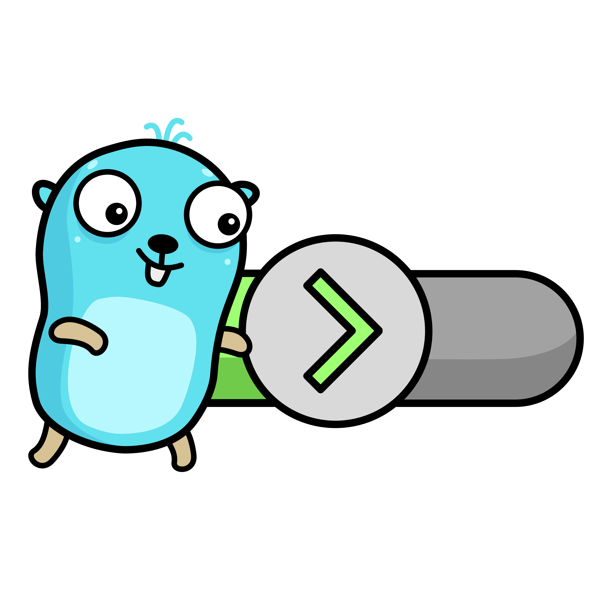

<div>
<h1>Runner Service</h1>

</div>

## About
### Runner Service Overview
The Runner service allows you to ***execute*** and ***share*** Go code snippets.

Protobuf contract: [runner](https://github.com/paniccaaa/protos/blob/main/proto/runner/runner.proto) 

### Integration with SSO Service, Redis and Prometheus

The Runner service leverages the [SSO](https://github.com/paniccaaa/sso) service to verify administrative privileges when processing the DeleteCode RPC. This integration ensures that only authorized administrators can delete shared code snippets, enhancing security and access control within the application.

The Runner service uses Redis for caching shared code snippets to improve performance. When a code snippet is requested, the service first checks Redis. If the snippet is not found in the cache, it is retrieved from PostgreSQL and then stored in Redis for future requests. This reduces database load and speeds up data retrieval.

The Runner service uses Prometheus to collect metrics. For example:
```sh
curl http://localhost:9100/metrics
```

## Stack

- **gRPC** / gRPC-gateway (for [understanding](https://github.com/grpc-ecosystem/grpc-gateway))
- **PostgreSQL**
- **Redis**
- **cleanenv**
- **slog**

## Installation

Before running the application, make sure Go are installed on your system.

1. **Clone** the repository
```bash
git clone https://github.com/paniccaaa/runner.git
cd runner
```
2. **Create** the .env, local.yaml and Makefile (see .example in repository). Also see [sso](https://github.com/paniccaaa/sso).
3. **Run** the app locally
```bash
make run 
```

## Endpoints

For detailed API documentation, you can view the Swagger documentation. Copy the contents of [runner.swagger.json](https://github.com/paniccaaa/protos/blob/main/gen/golang/runner/runner.swagger.json) and paste it into [Swagger Editor](https://editor-next.swagger.io/) to explore and interact with the API.

### REST (gRPC-gateway)
- **POST /run**: Execute a Go code snippet.
- **POST /share**: Share a Go code snippet.
- **GET /shared/{id}**: Retrieve a shared Go code snippet by id.
- **DELETE /shared/{id}?user_id={user_id}**: Delete a shared Go code snippet by id (only for admins, see [sso](https://github.com/paniccaaa/sso))

### gRPC
- **RunCode**
```bash
$ grpcurl -plaintext -d '{"code": "package main\nimport \"fmt\"\nfunc main() {\n    fmt.Println(\"Hello RunCode!\")\n}"}' \
 localhost:44000 runner.Runner/RunCode

{
  "code": "package main\nimport \"fmt\"\nfunc main() {\n    fmt.Println(\"Hello RunCode!\")\n}",
  "output": "Hello RunCode!\n"
}
```
- **ShareCode**
```bash
$ grpcurl -plaintext -d '{"code": "package main\nimport \"fmt\"\nfunc main() {\n    fmt.Println(\"Hello world! Test ShareCode\")\n}"}' \
 localhost:44000 runner.Runner/ShareCode

{
  "id": "2"
}
```
- **GetCodeByID**
```bash
$ grpcurl -plaintext -d '{"id": "2"}' localhost:44000 runner.Runner/GetCodeByID

{
  "code": "package main\nimport \"fmt\"\nfunc main() {\n    fmt.Println(\"Hello world! Test ShareCode\")\n}",
  "output": "Hello world! Test ShareCode\n"
}
```
- **DeleteCode**
```bash
$ grpcurl -plaintext -d '{"id": 2, "user_id": 1}' localhost:44000 runner.Runner/DeleteCode

{
  "success": true
}
```
## Database migration
See Makefile.example and make sure [migrate](https://github.com/golang-migrate/migrate/tree/master/cmd/migrate) on your system.
```bash
make mig_up
# and
make mig_down
```
